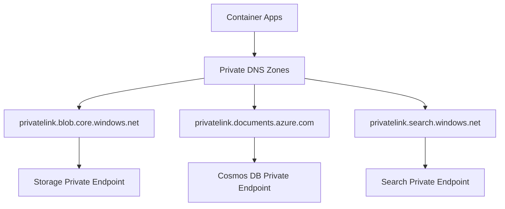

# Networking Architecture Documentation

## Overview

The Realtime Synthetic Call Center Agents solution implements an **enterprise-grade private networking architecture** that ensures secure communication between all backend services while maintaining public internet access for the container applications. This document provides detailed technical information about the networking setup, security controls, and architectural decisions.

## Network Topology

### Virtual Network (VNet) Structure

The solution deploys a dedicated Virtual Network with a carefully designed subnet architecture:

```
VNet: 10.0.0.0/16
├── Backend Subnet: 10.0.1.0/24
│   ├── Private Endpoints for Azure Storage
│   ├── Private Endpoints for Azure Cosmos DB  
│   └── Private Endpoints for Azure AI Search
└── Apps Subnet: 10.0.0.0/27
    └── Container Apps Environment (VNet-integrated)
```

**Key Configuration:**
- **VNet Address Space**: `10.0.0.0/16` (65,536 IP addresses)
- **Backend Subnet**: `10.0.1.0/24` (254 usable IP addresses)
- **Apps Subnet**: `10.0.0.0/27` (30 usable IP addresses)

### Subnet Design Rationale

#### Backend Subnet (`10.0.1.0/24`)
- **Purpose**: Hosts private endpoints for all backend Azure services
- **Network Policies**: Private endpoint network policies are **disabled** to allow private endpoint deployment
- **Security**: No direct internet access - all communication through private endpoints
- **Capacity**: 254 IP addresses provide ample space for private endpoints and future expansion

#### Apps Subnet (`10.0.0.0/27`)
- **Purpose**: Dedicated subnet for Container Apps Environment
- **Delegation**: Delegated to `Microsoft.App/environments` for Container Apps
- **Capacity**: 30 IP addresses sufficient for Container Apps infrastructure
- **Internet Access**: Maintains outbound internet connectivity for application functionality

## Private Endpoints Configuration

### Deployed Private Endpoints

The solution creates private endpoints for all critical backend services:

| Service | Private Endpoint | Group ID | DNS Zone |
|---------|------------------|----------|----------|
| **Azure Storage** | `storage-pe-{token}` | `blob` | `privatelink.blob.core.windows.net` |
| **Azure Cosmos DB** | `cosmos-pe-{token}` | `Sql` | `privatelink.documents.azure.com` |
| **Azure AI Search** | `search-pe-{token}` | `searchService` | `privatelink.search.windows.net` |

### Private Endpoint Benefits

1. **Traffic Isolation**: All backend service communication stays within the VNet
2. **Reduced Attack Surface**: Services not accessible from public internet
3. **Compliance**: Meets enterprise requirements for data locality and network isolation
4. **Performance**: Lower latency through Azure backbone network
5. **Cost Optimization**: No egress charges for inter-service communication

## Private DNS Configuration

### DNS Resolution Architecture

Each private endpoint is configured with a dedicated Private DNS Zone to ensure proper name resolution:



### DNS Zone Configuration

Each Private DNS Zone includes:
- **Virtual Network Link**: Links the DNS zone to the VNet for resolution
- **DNS Zone Group**: Associates the private endpoint with the DNS zone
- **Automatic Registration**: Private endpoint IP addresses automatically registered

### Name Resolution Flow

1. **Application Request**: Container app requests `{storage-account}.blob.core.windows.net`
2. **DNS Query**: Query sent to Azure-provided DNS (168.63.129.16)
3. **Private DNS Zone**: Query forwarded to private DNS zone
4. **Private IP Resolution**: Returns private IP address of the private endpoint
5. **Direct Connection**: Traffic routed directly through VNet to private endpoint

## Container Apps Network Integration

### VNet Integration Configuration

The Container Apps Environment is configured with **VNet integration** using workload profiles:

```bicep
vnetConfiguration: {
  infrastructureSubnetId: appSubnetId
}
workloadProfiles: [
  {
    name: 'Consumption'
    workloadProfileType: 'Consumption'
  }
]
```

### Benefits of VNet Integration

1. **Hybrid Connectivity**: Applications can access both private endpoints and public internet
2. **Network Security**: Traffic to private endpoints stays within VNet
3. **Custom DNS**: Automatic integration with private DNS zones
4. **Future Extensibility**: Enables additional networking features (NSGs, UDRs, etc.)

## Service-Level Security Controls

### Azure Storage Account

**Network Access Configuration:**
```bicep
publicNetworkAccess: 'Disabled'
networkAcls: {
  defaultAction: 'Deny'
  bypass: 'AzureServices'
}
allowBlobPublicAccess: false
allowSharedKeyAccess: false
```

**Security Features:**
- Public network access completely disabled
- Only trusted Azure services can bypass network restrictions
- No public blob access allowed
- Shared key access disabled (managed identity only)

### Azure Cosmos DB

**Network Security Configuration:**
```bicep
publicNetworkAccess: 'Disabled'
isVirtualNetworkFilterEnabled: true
virtualNetworkRules: []
ipRules: []
```

**Security Features:**
- Public network access disabled
- Virtual network filtering enabled
- No IP-based access rules (private endpoint only)
- Serverless tier for cost optimization

### Azure AI Search

**Network Configuration:**
- Private endpoint enabled for secure access
- Service integrated with VNet-based applications
- Managed identity authentication for secure connections

## Authentication & Identity

### User-Assigned Managed Identity

The solution uses a **single user-assigned managed identity** across all services:

**Benefits:**
- **Keyless Authentication**: No connection strings or API keys stored
- **Centralized Identity**: Single identity for all Azure services
- **RBAC Integration**: Granular permissions via Azure RBAC
- **Audit Trail**: Centralized logging and monitoring

**Assigned Roles:**
- `Storage Blob Data Reader` - Read access to storage containers
- `Storage Blob Data Contributor` - Write access for document ingestion
- `Cosmos DB Built-in Data Contributor` - Full access to Cosmos DB
- `Search Index Data Contributor` - AI Search indexing operations
- `Search Service Contributor` - Search service management
- `Key Vault Secrets User` - Access to Key Vault secrets

## Network Security Best Practices

### Implemented Security Controls

1. **Defense in Depth**
   - Network-level isolation (VNet/subnets)
   - Service-level access controls (network ACLs)
   - Identity-based access (managed identity + RBAC)

2. **Zero Trust Principles**
   - Default deny network policies
   - Explicit service-to-service authentication
   - Minimal privilege access assignments

3. **Traffic Encryption**
   - All traffic encrypted in transit (TLS 1.2+)
   - Private endpoint connections use Azure backbone
   - No unencrypted communication paths

4. **Monitoring & Logging**
   - VNet flow logs (when enabled)
   - Private endpoint connection monitoring
   - Service-level diagnostic logging

### Compliance Considerations

The networking architecture supports compliance with:
- **SOC 2 Type II**: Network isolation and access controls
- **ISO 27001**: Information security management
- **PCI DSS**: Network segmentation requirements
- **GDPR**: Data locality and protection controls

## Deployment Considerations

### Prerequisites

- **Subscription Permissions**: Owner or Contributor + User Access Administrator
- **Resource Quotas**: Sufficient VNet, subnet, and private endpoint quotas
- **Regional Availability**: All services available in deployment region

### Deployment Process

1. **VNet Creation**: Base network infrastructure provisioned
2. **Subnet Configuration**: Dedicated subnets with proper delegation
3. **Service Deployment**: Backend services with network restrictions
4. **Private Endpoint Creation**: Secure connectivity established
5. **DNS Configuration**: Private DNS zones and virtual network links
6. **Container Apps Deployment**: VNet-integrated application environment

## Monitoring & Troubleshooting

### Network Monitoring

**Recommended Monitoring:**
- Azure Network Watcher for VNet diagnostics
- NSG flow logs for traffic analysis
- Private endpoint connection health
- DNS resolution monitoring

**Key Metrics:**
- Private endpoint connection status
- DNS query resolution times
- Container Apps networking health
- Service-to-service connectivity

### Troubleshooting Common Issues

1. **DNS Resolution Problems**
   - Verify private DNS zone configuration
   - Check virtual network links
   - Validate DNS zone group associations

2. **Connectivity Issues**
   - Confirm private endpoint provisioning state
   - Verify service network access policies
   - Check managed identity permissions

3. **Performance Issues**
   - Monitor private endpoint latency
   - Review VNet routing configuration
   - Analyze service-level metrics

## Future Enhancements

### Potential Network Improvements

1. **Network Security Groups (NSGs)**
   - Granular traffic filtering rules
   - Application-level security policies
   - Enhanced compliance controls

2. **Azure Firewall Integration**
   - Centralized outbound traffic control
   - Advanced threat protection
   - Comprehensive logging and analytics

3. **ExpressRoute Connectivity**
   - Dedicated private connection to on-premises
   - Hybrid cloud architecture support
   - Enhanced security and performance

4. **Additional Private Endpoints**
   - Azure Key Vault private endpoint
   - Azure Monitor private endpoints
   - Third-party service integrations

## Cost Optimization

### Networking Costs

**Current Cost Components:**
- VNet: No additional charges
- Private Endpoints: ~$7.20/month per endpoint
- Private DNS Zones: ~$0.50/month per zone
- Data Processing: ~$0.01/GB through private endpoints

**Cost Optimization Strategies:**
- Consolidate private endpoints where possible
- Use Azure Reserved Instances for predictable workloads
- Monitor data transfer costs between services
- Implement lifecycle policies for storage optimization

## Conclusion

The networking architecture provides enterprise-grade security while maintaining the flexibility needed for a modern cloud application. The combination of VNet integration, private endpoints, and managed identity authentication creates a robust, secure, and scalable foundation for the AI-powered call center solution.

For additional technical details or troubleshooting assistance, refer to the [Azure Virtual Network documentation](https://docs.microsoft.com/en-us/azure/virtual-network/) and [Azure Private Link documentation](https://docs.microsoft.com/en-us/azure/private-link/).