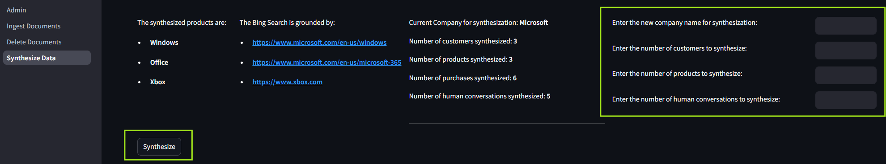
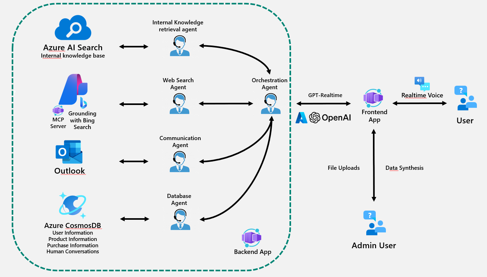

# Realtime Synthetic Call Center Agents
**Realtime Synthetic Call Center Agents** is a solution that simulates AI-driven contact center scenarios using synthetic data and realtime voice interaction. 

It allows users to ingest own documents (PDF, Word, TXT, HTML etc.) to build an `internal knowledgebase` for the `internal kb agent` to query on and instantly synthesize structured data about customers, products, purchases and human-agent interactions for `database agent` to perform actions (read, update) upon, enabling rapid prototyping and demonstration of AI enabled multi-agent pattern. 

Addtionally, based on the input company name, a `web search agent` is also available to retrieve up-to-date information for users and ground the answer by the related products from that company. 


The multi-agent system supports internal knowledge base query, web searche (grounded by the synthetic product of a real given company e.g. Microsoft), and database actions (create, update), making it ideal for showcasing AI-driven customer support and automation in call centers and retail environments.

## How to get it work

- [Deploy the application](#how-to-deploy)
- Click on the backend app URL from the output of `azd up`.
- read the instructions on the 'Admin' page:
    - use the 'Ingest Documents' and 'Delete Documents' pages to manage documents for the internal knowledge base.
    
    - use the 'Synthesize Data' page to dynamically synthesize a demo database in Azure CosmosDB with Customer, Product, Purchases tables.
    
- Click on the frontend app URL from the output of `azd up`.
- Choose one of the customer name to log in.
- Click on recording button or press 'P'
- Speak

### Sample Questions

- I want to check if you have the up-to-date information about me.
- Pleae change my address to [any address with street, number, city, postal code, country]
- What products are currently available from your product catalog?
- I want to take an new order with 2 units of [any product from the catalog]
- Send an email to [your real Email address] to confirm my order. 
- Looking at the internal knowledge base, could you tell me [any question for the document you ingested]
- What is the latest news about [the company name you synthesized data from or one of its related brand]?

## How to deploy

### Depenendencies

- [Azure CLI](https://learn.microsoft.com/en-us/cli/azure/what-is-azure-cli): `az`
- [Azure Developer CLI](https://learn.microsoft.com/en-us/azure/developer/azure-developer-cli/overview): `azd`
- [Python](https://www.python.org/about/gettingstarted/): `python`
- [UV](https://docs.astral.sh/uv/getting-started/installation/): `uv`
- Optionally [Docker](https://www.docker.com/get-started/): `docker`

### Deployment and setup

```sh
git clone [placeholder for the repo URL]
cd [placeholder for the repo name]
azd up
```

>[!NOTE]
>Once deployed, you need to authorise the solution to use your M365 email account for the outbound email capability.
> [Authorise mail access](./docs/mail_authorisation.md)

>[!NOTE]
>AZD will also setup the local Python environment for you, using `venv` and installing the required packages.

## Local execution

Once the environment has been deployed with `azd up` you can also run the aplication locally.

Please follow the instructions in [the instructions in `src/chainlit`](./src/frontend/README.md)

## Architecture



## Contributing

This project welcomes contributions and suggestions. Please see [CONTRIBUTING.md](CONTRIBUTING.md) for details.

## License

This project is licensed under the MIT License. See [LICENSE.md](LICENSE.md) for details.

## Resources

- [Chainlit Documentation](https://docs.chainlit.io/)
- [Azure OpenAI Documentation](https://docs.microsoft.com/en-us/azure/cognitive-services/openai/)
- [VoiceRAG Documentation](https://techcommunity.microsoft.com/blog/azure-ai-services-blog/voicerag-an-app-pattern-for-rag--voice-using-azure-ai-search-and-the-gpt-4o-real/4259116)
- This project is based on the ideas and implementation of the following projects:
    - [AOAI ContactCenterDemo](https://github.com/HaoZhang615/AOAI_ContactCenterDemo)
    - [Azure Samples: agentic-voice-assistant](https://github.com/Azure-Samples/agentic-voice-assistant)
    - [Azure Samples: chat-with-your-data-solution-accelerator](https://github.com/Azure-Samples/chat-with-your-data-solution-accelerator)