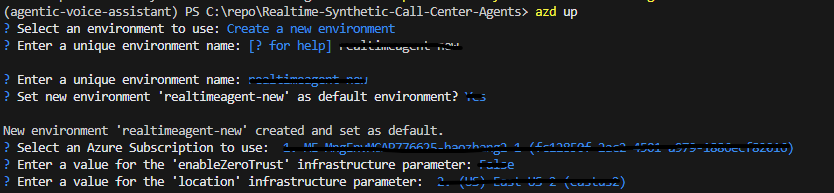
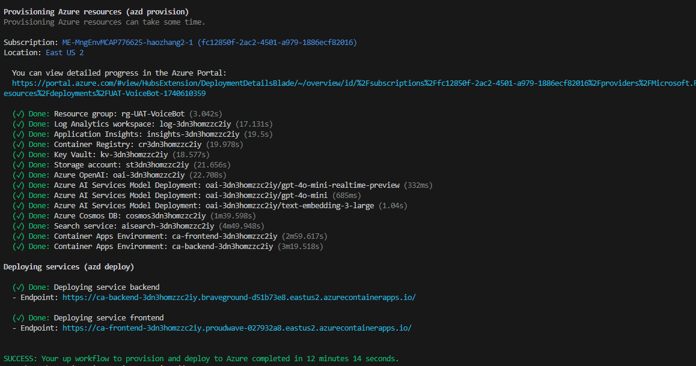
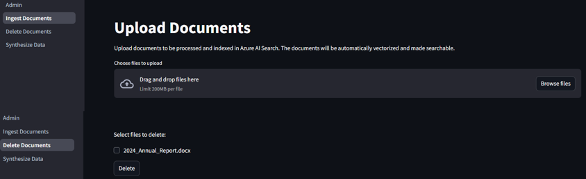
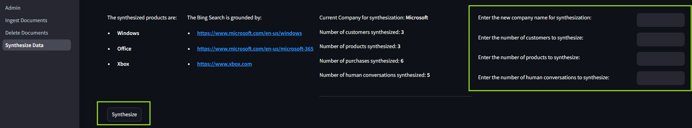
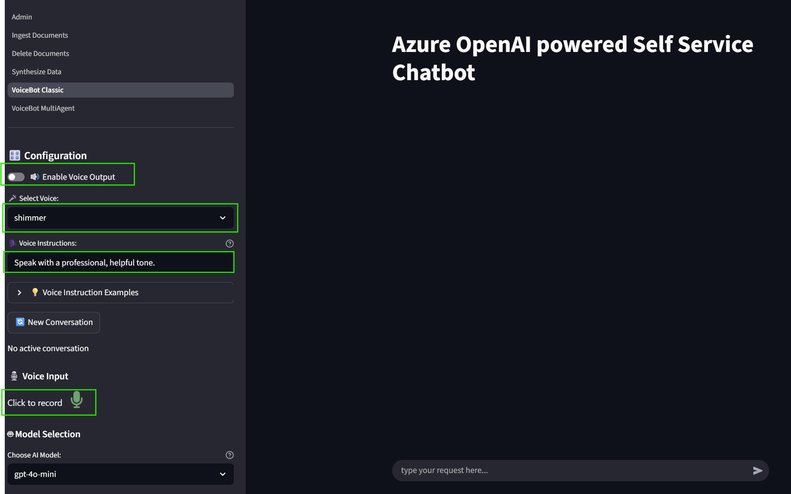
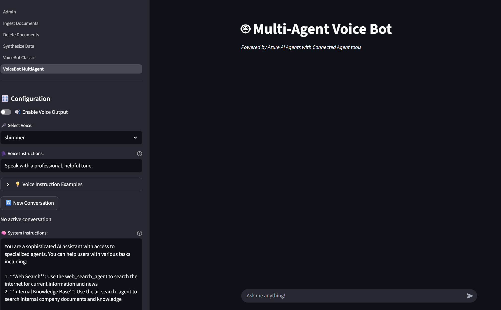
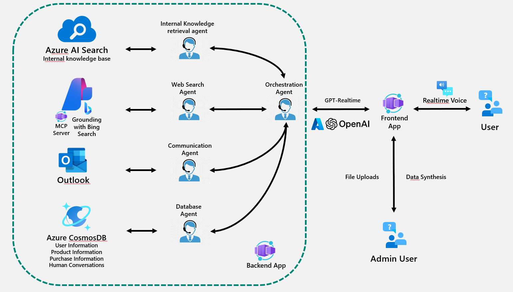

# Realtime Synthetic Call Center Agents

**Realtime Synthetic Call Center Agents** is a comprehensive AI-powered solution that simulates intelligent contact center scenarios using synthetic data and real-time voice interaction. Built on Azure, this multi-agent system demonstrates modern AI capabilities for customer service automation.

## Key Features

🎯 **Multi-Agent Architecture**: Three specialized AI agents working together:
- **Internal Knowledge Base Agent**: Queries uploaded documents (PDF, Word, TXT, HTML) for company information
- **Database Agent**: Performs CRUD operations on customer, product, and order data stored in Azure Cosmos DB
- **Web Search Agent**: *(Currently disabled)* ~~Retrieves real-time information using Bing Search API, grounded by synthetic product data~~

🗣️ **Voice-First Experience**: Real-time speech-to-text and text-to-speech powered by Azure OpenAI
📊 **Dynamic Data Synthesis**: Automatically generates realistic customer and product data for demonstration
⚡ **Rapid Prototyping**: Modular design enables quick customization and feature addition


## Getting Started

### Prerequisites

- [Azure CLI](https://learn.microsoft.com/en-us/cli/azure/what-is-azure-cli): `az`
- [Azure Developer CLI](https://learn.microsoft.com/en-us/azure/developer/azure-developer-cli/overview): `azd`
- [Python 3.8+](https://www.python.org/downloads/)
- [UV Package Manager](https://docs.astral.sh/uv/getting-started/installation/)
- Optional: [Docker](https://www.docker.com/get-started/) for containerized deployment
- ~~Optional: [Bing Search V7 API](https://azure.microsoft.com/en-us/products/cognitive-services/bing-web-search-api) for web search functionality~~ *(Currently disabled)*

### Quick Deployment

```bash
git clone https://github.com/HaoZhang615/Realtime-Synthetic-Call-Center-Agents.git
cd Realtime-Synthetic-Call-Center-Agents
azd up
```

#### Enterprise/Zero Trust Deployment

For production environments requiring enhanced security:

```bash
git clone https://github.com/HaoZhang615/Realtime-Synthetic-Call-Center-Agents.git
cd Realtime-Synthetic-Call-Center-Agents
git checkout privatenetworking
azd up
```

This deployment includes:
- Private endpoints for Azure AI Search, Cosmos DB, and Storage
- Virtual Network integration for Container Apps
- Zero-trust network architecture with no public internet access between services

Example: initiate deployment

Example: successful deployment


### Post-Deployment Setup

1. **Configure Email Integration**: Follow the [mail authorization guide](./docs/mail_authorisation.md) to enable outbound email capabilities
2. **Access the Applications**:
   - **Backend Admin Portal**: Use the backend URL from `azd up` output to manage documents and synthesize data
   - **Frontend Voice Interface**: Use the frontend URL to interact with the AI assistant

>[!NOTE]
>Once deployed, you need to authorise the solution to use your M365 email account for the outbound email capability.
> [Authorise mail access](./docs/mail_authorisation.md)

>[!NOTE]
>AZD will also setup the local Python environment for you, using `venv` and installing the required packages.

## How It Works

### 1. Backend: Document Management
Upload and manage your organization's documents through the backend admin interface:
- Navigate to "Ingest Documents" to upload PDF, Word, TXT, or HTML files
- Use "Delete Documents" to manage the knowledge base
- Documents are automatically indexed in Azure AI Search



### 2. Backend: Data Synthesis
Generate realistic demo data for testing and demonstrations:
- Access the "Synthesize Data" page in the backend
- Automatically creates customer profiles, product catalogs, and purchase history
- Data is stored in Azure Cosmos DB with proper relationships



### 3. Backend: Classic VoiceBot Interaction


Experience natural conversation with the AI assistant:
- Choose a voice, set the tone, change to different models and temperature to simulate
- Toggle the button to enable voice output
- Click the recording button to start speaking (automatic detection of ending)
- The system processes speech in real-time and responds with voice

### 4. Backend: Multi-Agent Interaction


Experience advanced conversation with multiple AI agents:
- powered by Azure AI Agent Service
- Adopting Connected Agents feature (concierge agent, web search agent, internal knowledgebase agent)
- The system manages tool calling, context and conversation flow seamlessly

### 5. Frontend: Realtime Voice Interaction

1. select a customer/user (that was synthesized before) to log in 

2. Press the 'P' key to start voice based conversation:

Example questions:
    **Customer Information Management**:
    - "I want to check if you have the up-to-date information about me"
    - "Please change my address to 123 Main Street, New York, NY 10001, USA"

    **Product and Order Management**:
    - "What products are currently available from your catalog?"
    - "I want to place a new order for 2 units of [product name]"
    - "Send an email to [your-email@domain.com] to confirm my order"

    **Knowledge Base Queries**:
    - "Looking at the internal knowledge base, could you tell me about [topic from uploaded documents]"

    **Real-time Information**:
    - "What is the latest news about [company name you synthesized data from]?"

## Development and Customization

### Modular Deployment

Update specific components without full redeployment:

```bash
# Deploy only frontend changes
azd deploy frontend

# Deploy only backend changes
azd deploy backend
```

These targeted deployments allow for faster development cycles and testing while preserving your Azure resource configuration and data.

### Local Development

For local testing and development:

```bash
cd src/frontend
uv sync
source .venv/bin/activate  # On Windows: .venv\Scripts\activate
chainlit run ./chat.py
```

Once the environment has been deployed with `azd up` you can also run the application locally.

Please follow the instructions in [the frontend development guide](./src/frontend/README.md) for detailed setup.

### Code Structure

The codebase has been recently refactored for better maintainability (see [refactoring summary](./docs/voicebot_refactoring_summary.md)):

- **Utility Modules**: Common functionality centralized in `src/backend/utils/`
- **Voice Components**: Multiple voice interface implementations with shared utilities
- **Type Safety**: Comprehensive type hints and validation
- **Error Handling**: Standardized error handling and logging patterns

### Extensibility

Leverage Azure Logic Apps' extensive connector ecosystem to integrate with:
- **CRM Systems**: Dynamics 365, Salesforce, HubSpot
- **Communication**: Microsoft Teams, Slack, SMS services
- **Databases**: SQL Server, PostgreSQL, MySQL
- **Business Applications**: SAP, Oracle, custom APIs

Additionally, thanks to Azure Logic Apps' extensive connector ecosystem, the solution offers promising extensibility options. You can easily integrate with hundreds of services and systems such as:
- CRM and business systems (Dynamics 365, Salesforce, etc.)
- Communication platforms (Teams, Slack, SMS)
- Additional database systems
- Enterprise applications and services

This enables you to build complete end-to-end workflows that connect the AI assistant with your existing business processes and data sources without extensive custom coding.

## Architecture



The solution uses a modern, scalable architecture:
- **Frontend**: Chainlit-based voice interface deployed as Azure Container App
- **Backend**: Streamlit admin portal for data management and classic voice bot using tts ans stt models.
- **AI Services**: Azure OpenAI for language processing and speech
- **Data Layer**: Azure Cosmos DB for operational data, Azure AI Search for document indexing
- **Integration**: Azure Logic Apps for workflow automation and external system integration

## Contributing

We welcome contributions! Please see our [contributing guidelines](CONTRIBUTING.md) for details on:
- Reporting issues
- Submitting feature requests
- Creating pull requests
- Code of conduct

This project welcomes contributions and suggestions. Please see [CONTRIBUTING.md](CONTRIBUTING.md) for details.

## License

This project is licensed under the MIT License. See [LICENSE.md](LICENSE.md) for details.

## Resources and References

- [Chainlit Documentation](https://docs.chainlit.io/)
- [Azure OpenAI Service](https://docs.microsoft.com/en-us/azure/cognitive-services/openai/)
- [VoiceRAG Pattern](https://techcommunity.microsoft.com/blog/azure-ai-services-blog/voicerag-an-app-pattern-for-rag--voice-using-azure-ai-search-and-the-gpt-4o-real/4259116)
- [Azure Developer CLI](https://learn.microsoft.com/en-us/azure/developer/azure-developer-cli/)

### Inspiration

This project builds upon and extends ideas from:
- [Azure Samples: Agentic Voice Assistant](https://github.com/Azure-Samples/agentic-voice-assistant)
- [Azure Samples: Chat with Your Data Solution Accelerator](https://github.com/Azure-Samples/chat-with-your-data-solution-accelerator)
- [AOAI Contact Center Demo](https://github.com/HaoZhang615/AOAI_ContactCenterDemo)

## Roadmap

- [x] Multi-agent voice interface with real-time processing
- [x] Document ingestion and knowledge base management
- [x] Synthetic data generation for rapid prototyping
- [x] Zero-trust networking support
- [x] Code refactoring for improved maintainability
- [ ] Demo video and tutorials
- [ ] Conversation logging to Cosmos DB container `human_agent_conversations`
- [ ] Power BI dashboard integration for post-call analytics
- [ ] Enhanced monitoring and observability features