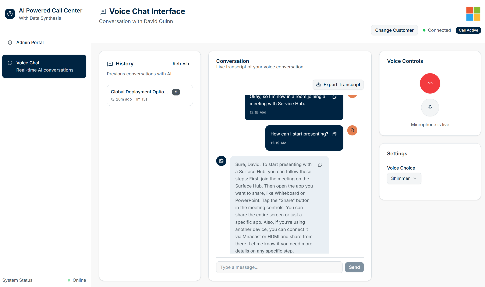

# Realtime Synthetic Call Center Agents

An enterprise-grade AI contact center solution demonstrating real-time voice interaction, multi-agent orchestration, and Azure AI integration. Built with FastAPI + React for production-ready deployments.

An enterprise-grade AI contact center solution demonstrating real-time voice interaction, multi-agent orchestration, and Azure AI integration. Built with FastAPI + React for production-ready deployments.


The multi-agent system supports internal knowledge base queries, web search (grounded by Bing Search), and database actions (read, create, update), making it ideal for showcasing AI-driven customer support and automation in call centers and retail environments.

## Security & Networking

This solution supports **enterprise-grade security** with configurable Zero Trust architecture. During deployment with `azd up`, users can choose to enable Zero Trust networking for enhanced security:

### Zero Trust Architecture (Optional - Selected During Deployment) (**Work In Progress**) 
The `azd up` deployment process allows users to decide whether to enable Zero Trust architecture. When enabled:
- **All public endpoints are disabled** except for the AI Foundry/AI Services account (required for AI Search indexing skillset functionality)
- **Virtual Network (VNet) Integration**: Container Apps Environment deployed with VNet integration using workload profiles
- **Private Endpoints**: Backend services (Azure Storage, Cosmos DB, Azure AI Search, Key Vault) communicate privately through dedicated private endpoints
- **Private DNS Zones**: Custom DNS resolution ensures services resolve to private IP addresses within the VNet
- **Network Security**: Backend services deny public access and only allow communication through private endpoints
- **AI Services Exception**: The AI Foundry/AI Services account maintains public access and key-based authentication for AI Search compatibility

### Standard Deployment (Default)
When Zero Trust is not enabled:
- Services use public endpoints with managed identity authentication
- Simplified networking while maintaining security through RBAC and managed identities
- Easier troubleshooting and development workflows

### Authentication & Authorization
- **User-Assigned Managed Identity**: Single managed identity used across all Azure services for secure, keyless authentication
- **Role-Based Access Control (RBAC)**: Granular permissions assigned to the managed identity for each service
- **Azure Key Vault**: Secure storage for sensitive configuration like API keys
- **Azure Trusted Services**: Storage account configured to allow trusted Azure services (like AI Search) access

## 🚀 Local Development

### Quick Start (All Services)
```powershell
# 1. Clone the repository
git clone https://github.com/HaoZhang615/Realtime-Synthetic-Call-Center-Agents.git
cd Realtime-Synthetic-Call-Center-Agents

# 2. Login to Azure
az login
azd auth login

# 3. Deploy (one command!)
azd up

# Choose deployment option when prompted:
# - Standard (public endpoints) - Default, easier for testing
# - Zero Trust (private endpoints) - Enterprise security

# 4. After deployment, manually connect Bing Search in AI Foundry Portal
# (Required for Web Search Agent - see post-deployment steps below)
```

**Deployment creates:**
- Container Apps (Frontend + Backend)
- Azure OpenAI (GPT-4o Realtime, GPT-4.1-nano, text-embedding-3-large)
- Azure AI Search (hybrid + semantic search)
- Cosmos DB (synthetic data storage)
- Azure Storage (document ingestion)
- Azure AI Foundry (web search agent)
- Key Vault (secrets management)
- Optional: VNet + Private Endpoints (Zero Trust mode)

### Post-Deployment Steps

> [!NOTE]
> **Email Setup** - To enable outbound email functionality, authorize your M365 account:
> See [Email Authorization Guide](./docs/mail_authorisation.md)

### Using the Application

```powershell
# Get deployed URLs from azd output
azd env get-values | Select-String "FRONTEND_URL|BACKEND_URL"
```

**Admin Portal** (`FRONTEND_URL`):
1. **Upload Tab**: Upload PDF/DOCX/TXT documents to knowledge base
2. **Files Tab**: Manage uploaded documents
3. **Synthetic Data Tab**: Generate test customers, products, and conversations
4. **Dashboard Tab**: View statistics and conversation sentiment

**Voice Chat**:
- Click "Chat" in sidebar to start voice conversation
- Select a customer profile to log in
- Choose your preferred voice
- Ask questions about documents, products, or web search queries

**Sample Questions:**
- "Check my customer information"
- "Change my address to [street, city, postal code, country]"
- "What products are available in your catalog?"
- "I want to order 2 units of [product name]"
- "Send me an email confirming my order"
- "Tell me about [topic from uploaded document]"
- "What's the latest news about [topic]?"

## 💻 Local Development

### Start All Services

```powershell
# Starts MCP Server (8888), Backend (8000), Frontend (5173)
.\start-local-dev.ps1

# Check status
.\status-local-dev.ps1

# Stop all
.\stop-local-dev.ps1
```

**Service URLs:**
- Frontend: http://localhost:5173
- Backend API: http://localhost:8000/docs
- MCP Server: http://localhost:8888/health

### Targeted Deployment

```powershell
# Deploy only frontend changes
azd deploy frontend

# Deploy only backend changes
azd deploy backend
```

📖 **Full guide:** [LOCAL_DEVELOPMENT.md](./LOCAL_DEVELOPMENT.md)

## How to get it work

1. Access the backend FastAPI admin interface at the backend URL from the output of `azd up`.
2. Access the React frontend at the frontend URL from the output of `azd up` process
3. In the "Admin Portal" page:
-     Use the "Upload" tab in the admin interface to upload documents (PDF, DOCX, TXT) to populate the internal knowledge base

-     Use the "Files" tab in the admin interface to verify the documents have been indexed and delete any unwanted files

-     Use the "Synthetic Data" tab in the admin interface to create synthetic customers, products, purchases histories and customer conversations

-     Use the "Dashboard" tab in the admin interface to overview on the setup status and synthetic customer conversations by topic, product and agents.


4. In the "Voice Chat" page:
-     Choose one of the (synthesized) customer names to log in

-     Select the voice you want to use and click on the microphone button to start voice interaction

-     Speak to interact with the AI assistant


## 🏗️ Architecture

### Technology Stack

**Frontend:**
- React 18 + TypeScript + Vite
- Tailwind CSS + Radix UI
- WebSocket client for real-time audio

**Backend:**
- FastAPI + Uvicorn (async WebSocket)
- Multi-agent orchestration
- Azure SDK integration

**AI Foundry MCP Server:**
- Model Context Protocol server
- Stateless Bing Search wrapper
- JSON-RPC 2.0 over HTTP

**Azure Services:**
- Azure AI Foundry (Agent + Bing Search)
- Azure OpenAI (GPT-4o Realtime, GPT-4.1-nano, embeddings)
- Azure AI Search (hybrid + semantic + vector)
- Cosmos DB (NoSQL data)
- Azure Storage (document ingestion)
- Azure Logic Apps (email automation)
- Container Apps (serverless hosting)
- Key Vault (secrets)

### Multi-Agent System

1. **Root Orchestrator**: Routes requests, maintains session state
2. **Internal KB Agent**: Searches indexed documents with dynamic topic extraction
3. **Database Agent**: CRUD operations on Cosmos DB
4. **Web Search Agent**: Bing-grounded search via AI Foundry
5. **Executive Assistant**: Email automation via Logic Apps

### Security Options

**Standard Deployment (Default):**
- Public endpoints with managed identity authentication
- RBAC-based access control
- Simpler for development/testing

**Zero Trust Deployment (Optional):**
- VNet integration with dedicated subnets
- Private endpoints for Storage, Cosmos DB, AI Search, Key Vault
- Private DNS zones for internal resolution
- Network isolation (MCP server uses `.internal` domain)

📖 **Details:** [Networking.md](./Networking.md)

## 📚 Documentation

| Document | Description |
|----------|-------------|
| [LOCAL_DEVELOPMENT.md](./LOCAL_DEVELOPMENT.md) | Local development guide |
| [Networking.md](./Networking.md) | Zero Trust architecture details |
| [AGENT_FLOW_DIAGRAM.md](./docs/AGENT_FLOW_DIAGRAM.md) | Multi-agent execution flow |
| [DYNAMIC_KB_AGENT_TOPICS.md](./docs/DYNAMIC_KB_AGENT_TOPICS.md) | Dynamic topic extraction |
| [AI_FOUNDRY_INFRASTRUCTURE_SETUP.md](./docs/AI_FOUNDRY_INFRASTRUCTURE_SETUP.md) | AI Foundry setup guide |

## 🤝 Contributing

Contributions welcome! See [CONTRIBUTING.md](CONTRIBUTING.md) for guidelines.

## 📄 License

MIT License - See [LICENSE.md](LICENSE.md)

## 🙏 Credits

Inspired by:
- [Azure Samples: agentic-voice-assistant](https://github.com/Azure-Samples/agentic-voice-assistant)
- [Azure Samples: chat-with-your-data-solution-accelerator](https://github.com/Azure-Samples/chat-with-your-data-solution-accelerator)
- [AOAI ContactCenterDemo](https://github.com/HaoZhang615/AOAI_ContactCenterDemo)

## 📖 Resources

- [Azure AI Foundry Documentation](https://learn.microsoft.com/azure/ai-studio/)
- [Azure OpenAI Realtime API](https://learn.microsoft.com/azure/ai-services/openai/realtime-audio-quickstart)
- [Model Context Protocol (MCP)](https://modelcontextprotocol.io/)
- [VoiceRAG Pattern](https://techcommunity.microsoft.com/blog/azure-ai-services-blog/voicerag-an-app-pattern-for-rag--voice-using-azure-ai-search-and-the-gpt-4o-real/4259116)

## 📋 To-Do

- [ ] Add demo video
- [x] Implement conversation logging to Cosmos DB
- [x] Add conversation transcription download feature
- [ ] Implement customer authentication flow
- [ ] Add image input support in voice interaction

---

**Questions?** Open an issue or check the [documentation](#-documentation).