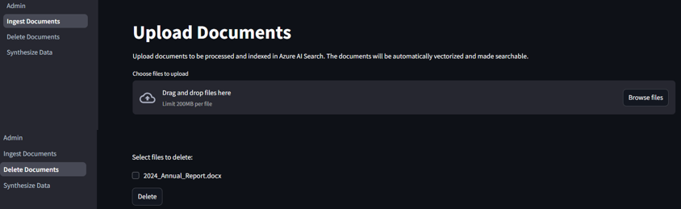
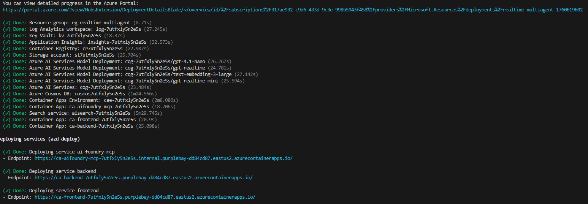

# Realtime Synthetic Call Center Agents
**Realtime Synthetic Call Center Agents** is a solution that simulates AI-driven contact center scenarios using synthetic data and realtime voice interaction. 

It allows users to ingest own documents (PDF, Word, TXT, HTML etc.) to build an `internal knowledge base` for the `internal kb agent` to query on and instantly synthesize structured data about customers, products, purchases and human-agent interactions for `database agent` to perform actions (read, update) upon, enabling rapid prototyping and demonstration of AI enabled multi-agent pattern. 

Addtionally, based on the input company name, a `web search agent` is also available to retrieve up-to-date information for users and ground the answer by the related products from that company. 


The multi-agent system supports internal knowledge base query, web search (grounded by the synthetic product of a real given company e.g. Microsoft), and database actions (read, create, update), making it ideal for showcasing AI-driven customer support and automation in call centers and retail environments.

## Security & Networking

This solution implements **enterprise-grade security** with private networking between backend services while maintaining public internet access for the container applications:

### Private Network Architecture (detailed documentation in [Networking.md](Networking.md))
- **Virtual Network (VNet) Integration**: Container Apps Environment deployed with VNet integration using workload profiles
- **Private Endpoints**: All backend services (Azure Storage, Cosmos DB, Azure AI Search) communicate privately through dedicated private endpoints
- **Private DNS Zones**: Custom DNS resolution ensures services resolve to private IP addresses within the VNet
- **Network Security**: Backend services deny public access and only allow communication through private endpoints

### Authentication & Authorization
- **User-Assigned Managed Identity**: Single managed identity used across all Azure services for secure, keyless authentication
- **Role-Based Access Control (RBAC)**: Granular permissions assigned to the managed identity for each service
- **Azure Key Vault**: Secure storage for sensitive configuration like API keys
- **Azure Trusted Services**: Storage account configured to allow trusted Azure services (like AI Search) access

### Benefits
- **Enhanced Security**: Backend data and services isolated from public internet
- **Compliance Ready**: Private networking supports enterprise compliance requirements  
- **Zero-Trust Architecture**: Services authenticate using managed identities instead of connection strings
- **Scalable**: VNet integration allows for future expansion with additional subnets and security controls

## How to get it work

- [Deploy the application](#how-to-deploy)
- Click on the backend app URL from the output of `azd up`.
- read the instructions on the 'Admin' page:
    - use the 'Ingest Documents' and 'Delete Documents' pages to manage documents for the internal knowledge base.
    
    - use the 'Synthesize Data' page to dynamically synthesize a demo database in Azure CosmosDB with Customer, Product, Purchases tables.
    
- Click on the frontend app URL from the output of `azd up`.
- Choose one of the customer name to log in.
- Click on recording button or press 'P'
- Speak

### Sample Questions

- I want to check if you have the up-to-date information about me.
- Pleae change my address to [any address with street, number, city, postal code, country]
- What products are currently available from your product catalog?
- I want to take an new order with 2 units of [any product from the catalog]
- Send an email to [your real Email address] to confirm my order. 
- Looking at the internal knowledge base, could you tell me [any question for the document you ingested]
- What is the latest news about [the company name you synthesized data from or one of its related brand]?

## How to deploy

### Prerequisites

#### Tool Dependencies
- [Azure CLI](https://learn.microsoft.com/en-us/cli/azure/what-is-azure-cli): `az`
- [Azure Developer CLI](https://learn.microsoft.com/en-us/azure/developer/azure-developer-cli/overview): `azd`
- [Python](https://www.python.org/about/gettingstarted/): `python`
- [UV](https://docs.astral.sh/uv/getting-started/installation/): `uv`
- Optionally [Docker](https://www.docker.com/get-started/): `docker`
- Optionally a Bing Search V7 resource API in Azure for the web search agent to work.

#### Azure Permissions Required

**⚠️ Important**: This deployment requires **subscription-level permissions** due to resource group creation, managed identity provisioning, and role assignments.

The deploying user must have **one of the following** at the subscription level:

1. **Owner role** (Recommended)
   - Full access to create and manage all resources
   - Can assign roles to managed identities

2. **Contributor + User Access Administrator roles**
   - Contributor: Create and manage Azure resources
   - User Access Administrator: Assign roles for managed identity authentication

3. **Custom role** with these specific permissions:
   ```json
   {
     "permissions": [
       {
         "actions": [
           "Microsoft.Resources/subscriptions/resourceGroups/write",
           "Microsoft.Authorization/roleAssignments/write", 
           "Microsoft.Authorization/roleAssignments/read",
           "Microsoft.ManagedIdentity/userAssignedIdentities/*/action",
           "Microsoft.Resources/deployments/*",
           "*"
         ]
       }
     ]
   }
   ```

**Why subscription-level permissions are needed:**
- Creates a new resource group (if not specified)
- Provisions user-assigned managed identity
- Assigns RBAC roles across multiple Azure services (Storage, AI Search, Cosmos DB, Key Vault)
- Deploys infrastructure with subscription-scoped Bicep template

### Deployment and setup

```sh
git clone https://github.com/HaoZhang615/Realtime-Synthetic-Call-Center-Agents.git
cd .\Realtime-Synthetic-Call-Center-Agents\
azd up
```

The deployment process automatically provisions:
- **Azure Container Apps Environment** with VNet integration and workload profiles
- **Private networking** with VNet, private endpoints, and DNS zones for backend services
- **Managed identity** with appropriate RBAC permissions across all services
- **Secure storage** configuration with trusted services access for AI Search indexing

Example: initiate deployment

Example: successful deployment



>[!NOTE]
>Once deployed, you need to authorise the solution to use your M365 email account for the outbound email capability.
> [Authorise mail access](./docs/mail_authorisation.md)

>[!NOTE]
>AZD will also setup the local Python environment for you, using `venv` and installing the required packages.

## Customization and Iteration

This solution is designed to be easily customizable without requiring complete redeployment of Azure resources:

- To modify and deploy only the frontend components:
  ```sh
  # Make your changes to the frontend code
  azd deploy frontend
  ```

- To modify and deploy only the backend components:
  ```sh
  # Make your changes to the backend code
  azd deploy backend
  ```

These targeted deployments allow for faster development cycles and testing while preserving your Azure resource configuration and data.

Additionally, thanks to Azure Logic Apps' extensive connector ecosystem, the solution offers promising extensibility options. You can easily integrate with hundreds of services and systems such as:
- CRM and business systems (Dynamics 365, Salesforce, etc.)
- Communication platforms (Teams, Slack, SMS)
- Additional database systems
- Enterprise applications and services

This enables you to build complete end-to-end workflows that connect the AI assistant with your existing business processes and data sources without extensive custom coding.

## Local execution

Once the environment has been deployed with `azd up` you can also run the aplication locally.

Please follow the instructions in [the instructions in `src/frontend`](./src/frontend/README.md)

## Architecture

The solution is built on Azure Container Apps with a secure, private networking architecture:

### Core Components
- **Frontend**: Chainlit-based voice interface running in Azure Container Apps
- **Backend**: Streamlit admin interface for document management and data synthesis
- **Azure AI Search**: Vector search with built-in skillsets for document processing and embeddings
- **Azure Cosmos DB**: NoSQL database for storing customer, product, and transaction data
- **Azure Storage**: Blob storage for document ingestion with private endpoint access
- **Azure OpenAI**: GPT-4o models for chat completion and text-embedding-3-large for vector embeddings
- **Azure Logic Apps**: Email automation workflows using Office 365 connectors

### Networking Architecture
- **Virtual Network**: Dedicated VNet with segregated subnets for apps and backend services
- **Container Apps Environment**: VNet-integrated with workload profiles for enhanced security
- **Private Endpoints**: Secure, private connections to Azure Storage, Cosmos DB, and AI Search
- **Private DNS Zones**: Custom DNS resolution for private endpoint connectivity
- **Managed Identity**: User-assigned managed identity for secure, keyless service authentication

### Multi-Agent System
- **Internal Knowledge Base Agent**: Queries indexed documents using Azure AI Search
- **Database Agent**: Performs CRUD operations on Cosmos DB collections
- **Web Search Agent**: Retrieves real-time information via Bing Search API with product grounding

## Architecture Diagram


## Contributing

This project welcomes contributions and suggestions. Please see [CONTRIBUTING.md](CONTRIBUTING.md) for details.

## License

This project is licensed under the MIT License. See [LICENSE.md](LICENSE.md) for details.

## Resources

- [Chainlit Documentation](https://docs.chainlit.io/)
- [Azure OpenAI Documentation](https://docs.microsoft.com/en-us/azure/cognitive-services/openai/)
- [VoiceRAG Documentation](https://techcommunity.microsoft.com/blog/azure-ai-services-blog/voicerag-an-app-pattern-for-rag--voice-using-azure-ai-search-and-the-gpt-4o-real/4259116)
- This project is derived from the ideas and implementation of the following projects:
    - [Azure Samples: agentic-voice-assistant](https://github.com/Azure-Samples/agentic-voice-assistant)
    - [Azure Samples: chat-with-your-data-solution-accelerator](https://github.com/Azure-Samples/chat-with-your-data-solution-accelerator)
    - [AOAI ContactCenterDemo](https://github.com/HaoZhang615/AOAI_ContactCenterDemo)$

## to-do
- [x] **Implement enterprise-grade security with private networking and managed identity authentication**
- [ ] add a demo video
- [ ] add logic to log the conversation into CosmosDB under container `human_agent_conversations`
- [ ] add PowerBI dashboard integration for Post-Call Analysis