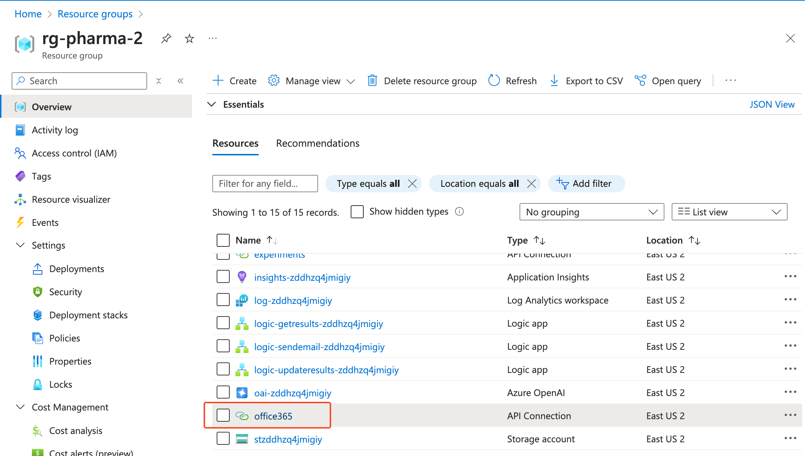
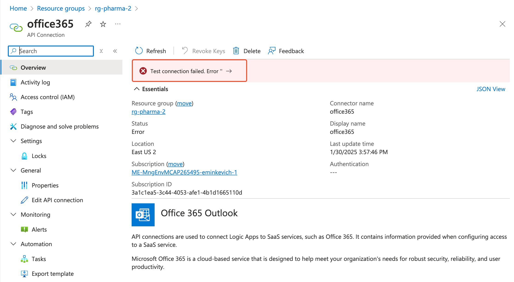
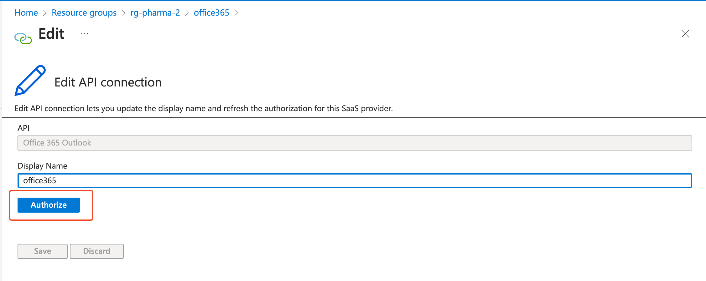
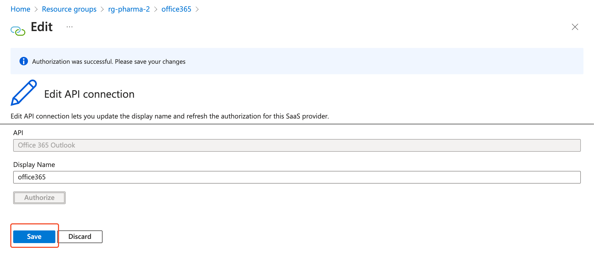

# Mail Authorisation

To authorise the voice assistant to send emails from your M365 account after deployment:

1. Go to Azure Resouce Group and select "Office 365" API Connection.
    

2. Click on "Test connection failed" error.
    

3. Click "Authorise".
    

4. Click "Save".
    

